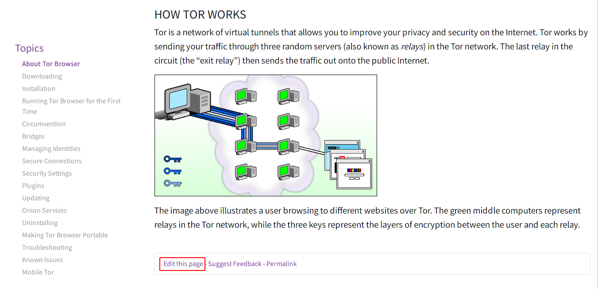
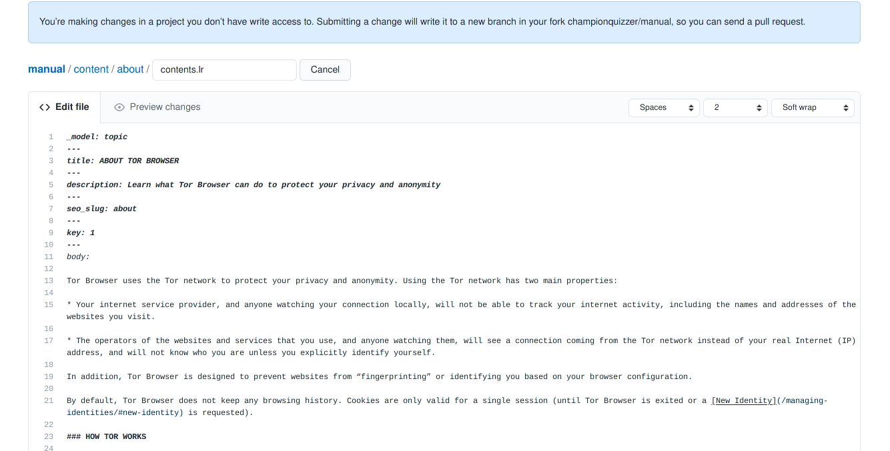

# Contributing to the Tor Project Website

First off, thanks for taking the time to contribute! 

The following is a set of guidelines for contributing to the Tor Project Website.

# Table Of Contents
 * [Introduction](#introduction)
    * [Lektor](#what-is-lektor) 
 * [How to contribute?](#how-to-contribute)
    * [Report Bugs or feedback](#report-bugs-or-feedback)
    * [Edit pages directly](#easy-edit-this-page-button)
    * [Compile a local version of the website](#advanced-compiling-a-local-version-of-the-website)
    * [Develop on the website](#develop-on-the-website)
    * [Translations](#translations)
 * [Ask for help!](#getting-help)

# Introduction

This is the repository of Tor Project website. The current online version of this portal can be found at [https://torproject.org](https://torproject.org) or [Tor Project Onion Service](http://expyuzz4wqqyqhjn.onion/).

To clone the code use either of

```git clone https://git.torproject.org/project/web/tpo.git/```

```torify git clone http://dccbbv6cooddgcrq.onion/project/web/tpo.git/```

or browse it [online](http://gitweb.torproject.org/project/web/tpo.git).

## What is Lektor?

[Lektor](https://www.getlektor.com/) is a framework to generate and serve websites from Markdown files.

The source code can be found at [GitHub](https://github.com/lektor/lektor).


# How to contribute?

## Report bugs or feedback

First, check if the bug is already known. You can search and read all the issues at https://gitlab.torproject.org/groups/tpo/-/issues. To create a new issue, please [request a new account](https://gitlab.onionize.space/) to access Tor Project's GitLab instance and [find the right repository](https://gitlab.torproject.org/tpo) to report your issue. Issues related to our websites should be filed under the [Web issue tracker](https://gitlab.torproject.org/groups/tpo/web/-/issues).

## (Easy) Edit this page button

Some lektor-based websites have an ```Edit this page``` that you can use to submit small corrections:



You will be presented with the file that generates the page:



Once you have made your changes:

* change the title and description of them to make it more descriptive (add the ticket's full URL if there is any).
  Remember that the first lines are the ones appearing on the git log, try to give a short explanation of why you did the change.
  Please don't leave it as 'Updated contents.lr' as that does not give a real idea of what you wanted to do.
  Same goes to the branches called 'patch-1'. Let yourself go! Be creative!
* Create a [pull request](https://github.com/torproject/community/pulls) for your contribution to be reviewed.
* If there is a ticket, mention the pull request in the comments.

## (Advanced) Compiling a local version of the website

1. Download and install Lektor: https://www.getlektor.com/downloads/

2. Install the lektor-i18n plugin and its [dependencies](https://github.com/numericube/lektor-i18n-plugin#prerequisites).

3. Clone the repository:

```git clone https://git.torproject.org/project/web/tpo.git```

4. Init the building blocks submodule:

```$ cd lego && git submodule update --init --recursive```

5. Translations for the website are imported by Jenkins when building the page, but if you want to test them, download the correct branch of the translations repo to the ./i18n/ folder.

6. Finally

To run a local continuous builder: ```$ lektor server```

To just build the website once: ```$ lektor build -O <folder>```

## Develop on the website 

> To follow this documentation it will be nice to set up a [local copy of the website](https://gitlab.torproject.org/tpo/web/community/-/wikis/Compiling-a-local-version-of-the-website) first.

Each website can be a little different but there are a few rules that are standard. Some of these rules are imposed by the static website generator that we use (Lektor). Other rules are made up by the www team to make development easier.

#### **Lego**

Each website repository has a submodule called [lego](https://gitlab.torproject.org/tpo/web/lego). This repository contains common elements to all the websites. 
To update the submodule, please run: `$ git submodule update --remote`
Lego is imported in the main repository and the single files are sym-linked to their relative folders. Ex: [header template](https://gitlab.torproject.org/tpo/web/tpo/blob/master/templates/header.html) in torproject.org main website.

#### **Content**

Content for the website is organized in the folder [content](https://gitlab.torproject.org/tpo/web/tpo/tree/master/content). The file responsible for content is always callend `contents.lr`.

Also the `contents.lr` implements the fields specified in the model. Models are defined in the folder [models](https://gitlab.torproject.org/tpo/web/tpo/tree/master/models).

Some of these `contents.lr` files do not have a body because the styling of the page required us to add some content to the template itself.

#### **Templates**

All the templates are located in the folder [templates](https://gitlab.torproject.org/tpo/web/tpo/tree/master/templates).

All the templates are built starting from [layout.html](https://gitlab.torproject.org/tpo/web/tpo/tree/master/templates/layout.html). 

For the user facing strings in the templates to be available for translation you need to enclose them like this: `{{ _('translatable strings') }}`.

Within the templates folder there is a folder called [macros](https://gitlab.torproject.org/tpo/web/tpo/tree/master/templates/macros). Macros are block of code that can be called from within a template:
```
<div class="row">
    <h2 class="text-primary">{{ _('Windows Expert Bundle') }}</h2>
    
    <table class="table">
      <tbody>
        <tr>
          <td>{{ _('Windows 10, 8, 7, Vista, XP, 2000, 2003 Server, ME, and Windows 98SE') }}</td>
          <td>{{ _('Contains just Tor and nothing else.') }}</td>
          <td class="text-right">
            
            {{ render_windows_expert(t.version, t.win32) }}
          </td>
        </tr>
      </tbody>
    </table>
  </div>
```

Finally recursive type of data are defined with databags.
These live in the folder [databags](https://gitlab.torproject.org/tpo/web/tpo/tree/master/databags).

This table summarises how each databag file is used

| file | function |
| ------ | ------ |
| about.ini | About page nav menu |
| menu.ini | Navbar top menu |
| menu_footer.ini | Footer menu |
| links.ini | External links in their respective locale |
| alternatives.ini | Locales and styling information for each language |
| download-alternatives-alpha.ini | Locales for the alpha version of Tor Browser |
| download-alternatives.ini | Locales for Tor Browser |
| versions.ini | Latest versions for all the downloads |
| platforms.ini | Supported platforms for the desktop versions |
| tags.ini | Content tags and styling information |


Check our [wiki pages](https://gitlab.torproject.org/tpo/web/community/-/wikis/How-to-develop-on-the-website) for more information.

## Translations

To help us to translate, please join the Tor Project team in [Transifex](https://www.transifex.com/). Also make sure to take a look at our [Community Portal](https://community.torproject.org/localization/).

# Getting help

We will be happy to help you. Join us at [`#tor-www` on IRC](https://webchat.oftc.net/?channels=tor-www).
